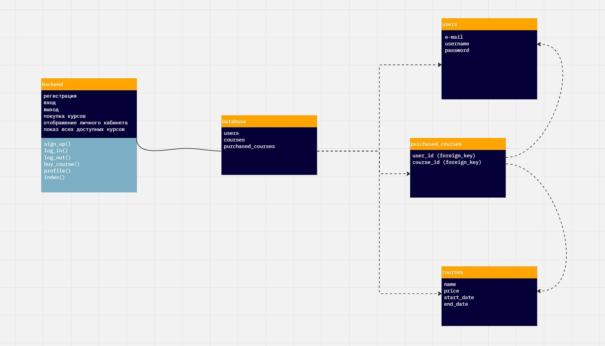

# course_store
This site is simple online course store with the functionality of registration, authorization and buying courses.
## Stack
- Django
- PostgreSQL
## Represitory overview
- store/ - project folder
  - course_store/ - app folder: views, models, forms, templates are stored here
  - store/ - autogenerated folder, urls and settings stored here
    - config/ - folder with file for distribution
  - manage.py
- Description.md - file with url description
## To start a project (for Windows10)
1. install git
2. take git repository
    - `$ git clone https://github.com/gygever/course_store.git`
3. go to project folder
4. install dependencies from requirements.txt
   - `$ py -m pip install -r requirements.txt`
5. go to /store/ in project folder
6. run app
    - `$ py manage.py runserver`
## To start a project (Ubuntu Mate 22.04.3)
1. install git
2. take git repository
    - `$ git clone https://github.com/gygever/course_store.git`
3. go to project folder
4. install dependencies from requirements.txt
  - `$ python3 -m pip install -r requirements.txt`
  - if you get `Error: pg_config executable not found`, write `$ sudo apt-get install libpq_dev` and try to install requirements again 
5. run app
    - `$ python3 manage.py runserver`
## Webapp design

